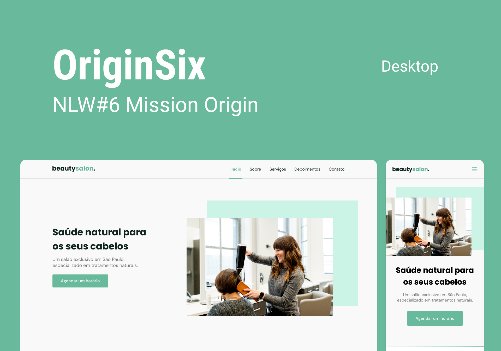

<div align="center">
    <h1 align="center">OriginSix</h1>
    <p>Landing page institucional de um salão de beleza. Com HTML semântico e estudo flex.</p>
    
</div>

# 📒 Índice
* [Descrição](#descrição)
* [Requisitos Funcionais](#requisitos)
* [Tecnologias](#tecnologias)
* [Design](#design)
  * [Cores](#cores)
  * [Fontes](#fontes)
  * [Ícones](#ícones)
* [Instalação](#instalação)
* [Licença](#licença)

# 📃 <span id="descrição">Descrição</span>
OriginSix é uma página institucional no formato One Page, responsiva, para usar em diversos tipos de micro, pequena e média empresas. Contém as seguintes seções: Header, Navigation, Home, Sobre, Serviços, Depoimentos, Contato e Footer. Desenvolvida durante a #NLW/Together realizada pela [**@Rocketseat**](https://github.com/Rocketseat).

# 📌 <span id="requisitos">Requisitos Funcionais</span>
- [x] Mobile first<br>
- [x] Responsividade<br>
- [x] Slider<br>

# 💻 <span id="tecnologias">Tecnologias</span>
- **HTML**
- **CSS**
- **JavaScript**
- **SwipeJS**
- **ScrollRevel**

# 🎨 <span id="design">Design</span>
- O modelo final para desktop e mobile está disponível na pasta `./design`

- <span id="cores">Cores<br></span>
  * #0F241D<br>
  * #69B99D<br>
  * #CCF4E6<br>
  * #F9F9F9<br>
  * #FFFFFF<br>

- <span id="fontes">Fontes<br></span>
  * Poppins, DM Sans, sans-serif

- <span id="ícones">Ícones<br></span>
  * Feather

# 🚀 <span id="instalação">Instalação</span>
```bash
  # Clone este repositório:
  $ git clone https://github.com/CleilsonAndrade/originsix.git
  $ cd ./originsix
```

# 📝 <span id="licença">Licença</span>
Esse projeto está sob a licença MIT. Veja o arquivo [LICENSE](LICENSE) para mais detalhes.

---

<p align="center">
  Feito com 💜 by CleilsonAndrade
</p>
